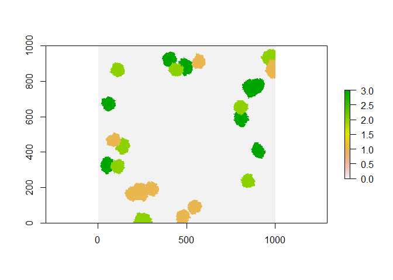
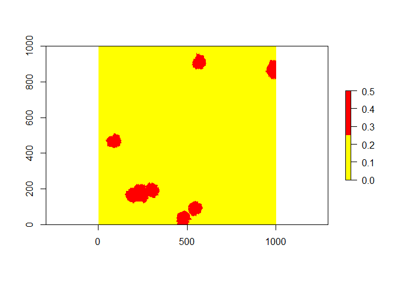
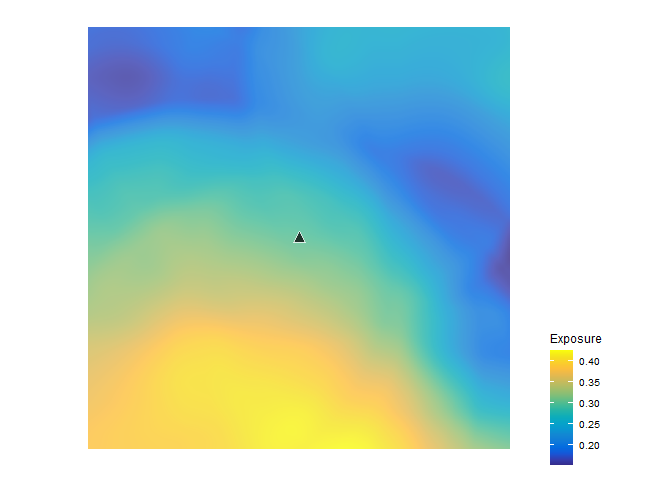

# Spatially Explicit Model of Landscape Exposure (SEMLE)

## Table of contents

1.  [Overview](#Overview)
2.  [Installation](#Installation)
3.  [Vignette](#Vingette)
4.  [Performance](#Performance)
5.  [Citing information](#Citing%20information)

## **Overview** <a name="Overview"></a>

This repository includes the R code of the model used for predicting the
exposure of bees to pesticides at landscape scales. The associated paper
has been been published as an article in *Science of the Total
Environment*, and is available through the publisher [here](XXX). In
this repo you can find code that was used to produce the findings in the
manuscript, as well as a vignette using the model in a simulated
landscape.

## **Installation** <a name="Installation"></a>

    install.packages("devtools")
    library(devtools)
    install_github("CCNicholson/SEMLE")

Or just copy and paste the code

## **Vignette** <a name="Vignette"></a>

The model requires the following inputs:

1.  A raster of classified land use, where cell values correspond to
    land use types  
2.  A raster of pesticide load, where cell values correspond to an
    observed or epxected quantity of pesticide (e.g.,
    *g*/)  
3.  A look up table that translates landuse codes to habitat resource
    values (e.g., floral resources for a bee)  
4.  The column name in this lookup table that contains the land use
    codes  
5.  The column names in this lookup table that contains the habitat
    resource values  
6.  A numerical value for
     -
    the foraging range of the organism. This is used to specify the
    dimensions of internal moving window functions  
7.  A description of organism foraging behavior as either
    -   “simple” - where the organism visits patches based on distance
        only  
    -   “complex” - where the organism visits patches based on their
        distance and quality relative to all other patches.

To demonstrate the use of the model we first simulate classified
landscapes using the `landscapeR` and `raster`packages

``` r
require(landscapeR)
require(raster)

### Landscape Params
set.seed(2024)
mapsize <- 1000
patch_fract <- 8 # patch number param
patch_size <- 5000 # patch size param

### Create an empty raster
m <- matrix(0, mapsize, mapsize) 
r <- raster(m, xmn=0, xmx=1000, ymn=0, ymx=1000)

### Create landscape with three classified land uses
LU.ras <- makeClass(r, npatch = patch_fract, 
                    size = patch_size, 
                    val=1)
LU.ras <- makeClass(LU.ras, npatch = patch_fract, 
                    size = patch_size, 
                    val=2)
LU.ras <- makeClass(LU.ras, npatch = patch_fract, 
                    size = patch_size, 
                    val=3)
plot(LU.ras)
```

<!-- -->

For the raster of pesticide load we will assume that one of the land use
classes (e.g., class 1) receives an arbitrary value of pesticide
application (0.5), while the other patches are untreated

``` r
# create load look up table
load.df <- data.frame(LU_Code = c(0, 1, 2, 3), 
                      LU_Pval = c(0.0, 0.5, 0.0, 0.0))

# reclassify base landscape based on table
load.ras <- reclassify(LU.ras, load.df)

plot(load.ras, col = heat.colors(2, rev = T))
```

<!-- -->

Internally, the model reclassifies the land use raster into a map of
resources based on a user provided lookup table. It then uses this map
to create a raster of distance weighted resources. Having this process
internal to the model is self-contained but inefficient (discussed
below). For the model to generate these resource maps, we create a data
frame with a column of the four land use values (`0, 1, 2, 3`) and a
column of corresponding resource values (`0.0, 0.9, 0.4, 0.2`). Note,
one could have multiple resource value columns (e.g., corresponding to
different seasons `LU_Rval_spring` vs `LU_Rval_summer`) that one could
iterate through.

``` r
# create resource look up table
RvalLookup.df <- data.frame(LU_Code = c(0, 1, 2, 3), 
                            LU_Rval = c(0.0, 0.9, 0.4, 0.2))  
```

Now we are ready to run the model. We provide the two raster inputs
(land use: `LU.ras` & pesticide load: `load.ras`). We provide the data
frame (`RvalLookup.df`) with land use and resource columns specified
(`LU_Code` & `LU_Rval`). We expect this organism to forage optimally
based on patch distance *and quality*, so we select `"complex"`
behavior. Lastly, we specify a foraging range. Note, this range value is
numerical and should make sense given the map units of the coordinate
reference system (e.g., EPSG:3857 & meters vs. EPSG:4326 & degrees). The
model has a few control structures to make sure the user is providing
appropriate spatial inputs, but it is advised to make sure the CRS and
overlay of maps is correct.

``` r
source("SEMLE.R")

# Use the SEMLE function to create an exposure raster object
exposure.ras <- SEMLE(
  LU_Map = LU.ras, 
  Load_Map = load.ras, 
  LU_lookup = RvalLookup.df, 
  LU_ID_col = "LU_Code",
  Rsrc_val_col = "LU_Rval",
  behavior = "complex",
  gamma_param = 300)  
```

The model outputs a raster of expected exposure. One could extract
values from any point in this map, for example the location of a bee
colony (depicted as a triangle).

<!-- -->

## **Performance** <a name="Performance"></a>

The model is slow (this sample landscape ran in c. 3.5 seconds on my
cpu), and run time will increase with map scale and foraging range. The
model is also slow because it contains a few processes that could be run
externally if one is iterating with the model (for example different
seasons in the same place). The moving window object could be specified
outside of and removed from the function. Similarly, in some instances
it might make sense to create the resource maps and distance weighted
forage maps outside of the function. These adjustments would speed
things up. Finally, the model deploys moving window functions with a
Fast Fourier Transform (thanks to [Melanie
Kammerer](https://github.com/melaniekamm) for the FFT code), which
speeds things up quite a bit, but there may be even more efficient
methods.

## **Citing information** <a name="Citing information"></a>

Lonsdorf, E. V., Nicholson, C. C., Rundlöf, M., & Williams, N. M.
(2023). A spatially explicit model of landscape pesticide exposure to
bees: development, exploration, and evaluation. *Science of the Total
Environment* doi: TBD .

The model code has been released on Zenodo and has a DOI:  
[](https://zenodo.org/doi/10.5281/zenodo.10066591)
